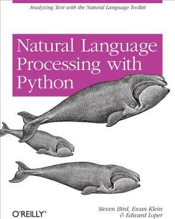
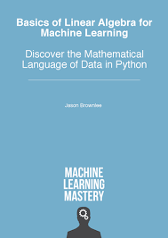
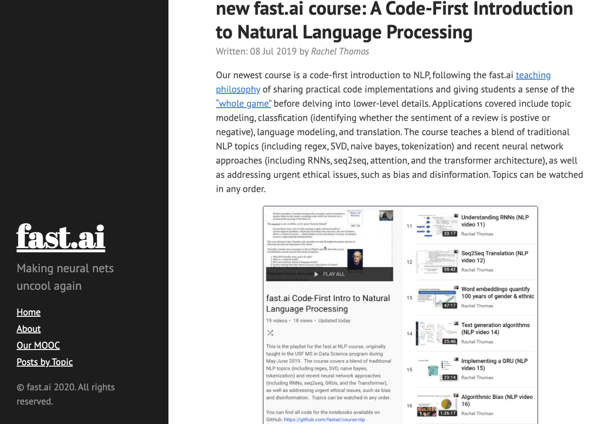

# NLP Resource Guide

## Table of Contents

* [General Information](#general-information)

## General Information

Natural Language Processing (NLP) is an ever-evolving field.  It is a subfield of linguistics, computer science, and AI. In focusing on AI, NLP gives the machines the ability to read, understand and derive meaning from human language.  As such it’s an important field of data science.  This repo will contain several resources regarding NLP, such as code examples from `Natural Language Processing with Python Analyzing Text with the Natural Language Toolkit by Steven Bird, Ewan Klein, Edward Loper`, online fast.ai’s course on NLP ` https://www.fast.ai/2019/07/08/fastai-nlp/`, and `Basics of Linear Algebra for Machine Learning by Jason Brownlee`, amongst other resources.   

    

        
    

    

        
    

    

        
    

